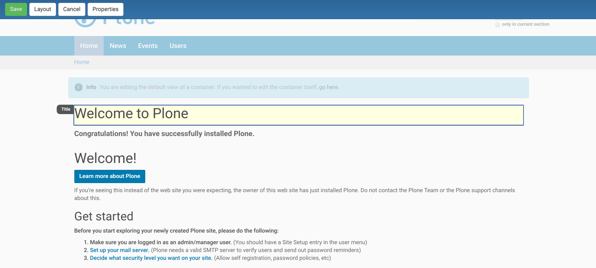
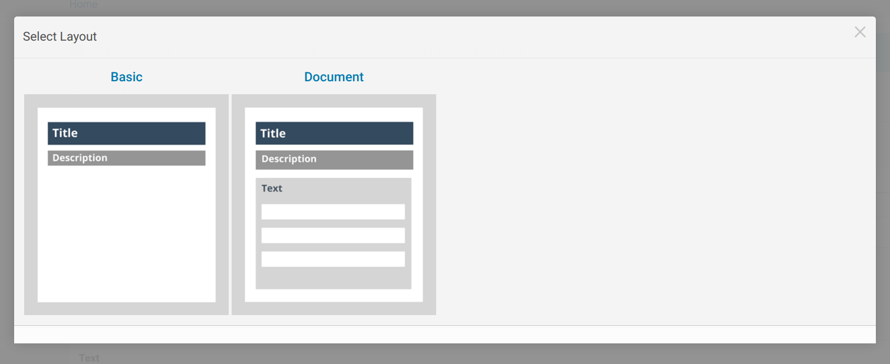

Mosaic
======

What is Mosaic?
---------------

A Plone add-on which allows creating and managing layouts from the Plone interface.

.. note::

    layout != design

Installation
------------

.. note::

    If you use heroku, Mosaic is pre-configured in the `heroku-instance <https://github.com/starzel/training-sandbox>`_

Modify :file:`buildout.cfg` by adding ``plone.app.mosaic`` to the part `instance`:

.. code-block:: ini
    :emphasize-lines: 9

    [instance]
    recipe = plone.recipe.zope2instance
    user = admin:admin
    http-address = 8080
    eggs =
        Plone
        Pillow
        plone.dojo [test]
        plone.app.mosaic

Also at the end of the file add the following version-pinns to the part `versions`::

    plone.tiles = 2.0.0b2
    plone.app.tiles = 3.0.3
    plone.app.standardtiles = 2.1.0
    plone.app.blocks = 4.0.6
    plone.app.drafts = 1.1.1
    plone.app.mosaic = 2.0rc5

Run your buildout to have it download and mosaic::

    $ bin/buildout -N

Then go to :menuselection:`Site Setup --> Add-ons` and Mosaic :guilabel:`Install`.

Principle
---------

The basic component of a Mosaic based layout is called a tile.
A layout is a combination of several tiles.

A tile is a dynamic portion of a web page, it can be a text element, an image, a field, etc.

Mosaic provides an editor able to easily position tiles across our theme's grid.

Enable the bahavior **Layout support** for the type ``talk``.

The Mosaic editor
-----------------

To enable the Mosaic editor on a content item change its default display as follows:
go to :menuselection:`Display --> Mosaic layout`.

You have now enabled the Mosaic editor as a replacement for the default edit form.

This editor allows to change our content fields content (just like the regular Plone form), but the fields are rendered into the view layout and they are edited in-place.

The top bar offers different buttons:

- :guilabel:`Save`, to save our field entries.
- :guilabel:`Cancel`, to cancel our changes.
- :guilabel:`Properties`, to access the content properties: it displays the regular Plone form tabs, but the fields currently involved in the layout are hidden.
- :guilabel:`Layout`, to manage the content layout.

Go to the front page of the website and update the layout
as follows:

1. Activate :menuselection:`Display --> Mosaic layout`
2. :guilabel:`Edit` and select the "Document" layout
3. The select :menuselection:`Layout --> Customize`
4. Add a Document Byline to the bottom of the layout :menuselection:`Insert > Document Byline`
5. Click :guilabel:`Save`

Change the content layout
-------------------------

If you click on :menuselection:`Layout --> Change`, you can choose the layout you want for our content.
The choices are restricted to the layout applicable to the current content-type.

For instance for a Page, Mosaic proposes (by default) two layouts: Basic and Document.

Customize a content layout
--------------------------

If you click on :menuselection:`Layout --> Customize`, the Mosaic editor switches to the layout mode, where you can still change our field values, but also change the layout:

- by hovering the page content, existing tiles are highlighted and you can drag & drop them in different places,
- by clicking in a tile, you can edit its content,
- by clicking outside the curently edited tile, you disable the edit mode.

In layout mode, the top bar contains two extra buttons:

- :guilabel:`Format`, which provides different simple formatting options for tiles (text padding, floating) or for rows (change background color),
- :guilabel:`Insert`, which allows to add new tiles to our layout.

The tiles
---------

Mosaic provides the following tiles:

- Structure tiles:

    - heading,
    - subheading,
    - text,
    - table,
    - bulleted list,
    - numbered list,
    - table of contents,
    - navigation: this tiles displays a navigation menu, its settings can be changed in a modal window (click on the "i" button on the bottom-right corner to display the modal),

- Media:

    - image,
    - embed: it allows to display any remote embeddable content (like a YouTube video for instance),
    - attachment,

- Fields: all the existing fields of the current content,

- Applications: for now, there is only Discussion, which shows the discussion form (discussion needs to be enable in the site setup),

- Properties:

    - document byline,
    - related contents,
    - keywords,

- Advanced:

    - content listing: it is a collection-like tile, it allows to list all contents matching given criterias (criterias can be changed in the modal window),
    - existing content: it allows to display another content in a tile

Exercise 1: Customize the home page layout
^^^^^^^^^^^^^^^^^^^^^^^^^^^^^^^^^^^^^^^^^^

Create an attractive layout for the home page.

..  admonition:: Solution
    :class: toggle

    - go to Display menu and select "Mosaic layout",
    - click Edit,
    - click on :menuselection:`Layout --> Customize`,
    - change the layout,
    - click Save.

Create a reusable layout
------------------------

When the layout has been customized, the :guilabel:`Layout` menu offers a :guilabel:`Save` action.

This action allows to save the current layout as a reusable layout.

If :file:`Global` is checked, the layout will be usable by any user (else it is restricted to the current user).

The layout is associated to the current content type, by default it will not be usable for other content types.

Once saved, our layout will be listed with the other available layouts when you click on :menuselection:`Layout --> Change`.

Exercise 2: create a layout for talks
^^^^^^^^^^^^^^^^^^^^^^^^^^^^^^^^^^^^^

.. note:: This exercise assumes that you have created a content type called "Talk".
          you can quickly create one by the following the steps in `Dexterity: Creating TTW content types <dexterity.html#creating-contenttypes-ttw>`__ documentation.

Create an attractive layout for a talk, save it and reuse it for another talk.

..  admonition:: Solution
    :class: toggle

    - customize a talk layout (see Exercise 2),
    - click on :menuselection::menuselection:`Layout --> Save`,
    - enter its title: "Talk", and select "Global",
    - click :guilabel:`Save`,
    - navigate to another talk,
    - go to :guilabel:`Display` menu and select "Mosaic layout",
    - click :guilabel:`Edit`,
    - click on Layout / Change,
    - choose "Talk".

.. seealso::

    * https://training.plone.org/5/ttw/mosaic.html
    * https://www.youtube.com/watch?v=ClfltAivJaQ
    * https://www.youtube.com/watch?v=A9e0D74BjFQ

